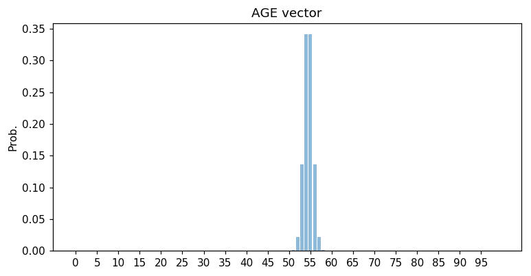

Age prediction CNN Project
--------------------

This repository provides an implementation of age prediction from images of faces using CNN models.

Age prediction project allows to use two base CNN models (MobileNetV2 and ResNet50) from [Keras](https://keras.io/applications/). The models are trained via transfer learning, where ImageNet pre-trained CNNs are used and fine-tuned for the classification task.

Age prediction CNN is compatible with Python 3.6 and is distributed under the MIT license.

## Requirements

    # Python3.5+
    # Keras 2.2.5+

## Installation:

    # create age_prediction_cnn folder
    mkdir age_prediction_cnn
    cd age_prediction_cnn

    # clone and install locally
    git clone git@github.com:vovaekb/age_prediction_cnn.git

## Preparing data
Use some preprocessing script to crop out faces in images and obtain a person age. You should have a batch of image files with faces named in following format:

    <id>_<age>_<gender>.jpg

You can use [UTKFace](https://susanqq.github.io/UTKFace/). This dataset was used to train models in the Age prediction CNN. UTKFace dataset provides labels for both age and gender.

For UTKFace dataset you can use the script transform_dataset_names.py in root folder of the project. This script allows to prepare face crops in required format.
To run this script:

    python transform_dataset_names.py --sample_dir <path_to_utkface_data> --output_dir <path_to_save_utkface_training_dataset>

## Running applications

When you are going to train the age predictor you just need to run python.

    python train_model.py --type <model_type> --range_mode True --train_sample_dir <train_sample_dir> --test_sample_dir <test_sample_dir> --model_path <model_path> --base_model <base_model_name> --img_dim <img_dim> --age_deviation <age_deviation> --load True --predict_gender True --fine_tuning True

Here **--type** denotes the type of NN model and can have two values ("classification" and "regression").

Parameters **--train_sample_dir** and **--test_sample_dir** specify path to train and test datasets accordingly.

**--model_path** specifies the path where model will be saved after training so predictor can load model from h5 file later.

**--base_model** means CNN architecture used (two values: MobileNetV2 and ResNet50).

**--img_dim** means dimension of input images for training (width, height), 128 on default.

**--age_deviation** specifies the deviation in age vector (in years), 5 on default

Optional parameters:

**--load** means that trained model will be loaded from h5 file rather than trained from scratch.

**--predict_gender** allows to apply gender classification in addition to age prediction.

**--fine_tuning** applies fine tuning of CNN model (freezing layers in base models and unzfreezing Conv layers).

If you run the application in training mode you should see something like this:

    Using TensorFlow backend.
    Initializing CNN model ...
    Starting training ...
    Epoch 1/13

    1/2 [==============>...............] - ETA: 8s - loss: 0.0947
    2/2 [==============================] - 13s 6s/step - loss: 0.0668 - val_loss: 0.1144
    Epoch 2/13
    ...

If you run the application with gender classification turned in you should see similar output with accuracy and loss for both age and gender.

Training accuracy and loss as well as validation accuracy will be printed in terminal.

If you run the application in loading mode you should see something like this:

    Using TensorFlow backend.
    Initializing CNN model ...
    
    Predicting for image 20170110224238891_10_0.jpg
    Predicted age: 0, true age: 10
    Predicted gender: M, true gender: M
    ...

If you run the application with gender classification turned on you should see similar output with predictions for both age and gender.

## Model training modes for age
### Classification mode
Unlike regular image classification age prediction should not be strictly discriminative. In this case soft decision making can be applied through predicting histogram of normal probability around the age value. Here we build a AGE vector represented as a histogram of a normal probability with mean in the age value with deviation 5 years. This is inspired by image aesthetics quantification problem.

We have no statistic data about ages so AGE vectors were generated manually. For generating AGE vectors we used method build_age_vector() in script utils.py locating in folder facematch/age_prediction/utils.

In the CNN model output layer is represented by a fully connected layer with 100 nodes and softmax activation.

As loss and accuracy metrics [Earth mover's distance](https://en.wikipedia.org/wiki/Earth_mover%27s_distance) and [Mean Absolute Error](https://en.wikipedia.org/wiki/Mean_absolute_error) are used respectively. Earth mover's distance measures the histogram similarity.

To run training in age classification mode use command:

    python train_model.py --type classification <options>

To run loading model from file and predicting age:

    python train_model.py --type classification <options> --load True

### Range classification mode
We also predict a range the age belongs to from following ranges: 0-5,5-10,10-15,15-20,20-25,25-30,...,75-80,80+. Here we use regular classification model where each class is represented by an age range.

To run training in age classification mode use command:

    python train_model.py --type classification --range_mode True <options>
    
To run loading model from file and predicting age use command with option --load True.

### Regression mode
In regression mode chosen predictor outputs single floating point value in range 0 to 1.0 representing age. [Mean squared error](https://en.wikipedia.org/wiki/Mean_squared_error) is used as loss.
In regression model output layer is represented by a fully connected layer with the only node and linear activation.

We applied scaling target age values to range [0, 1] and multiplying predictions by 100 when presenting results to user as it gives better accuracy results.

To run training in age classification mode use command:

    python train_model.py --type regression <options>

To run loading model from file and predicting age use command with option --load True.

## Gender classification
We also apply gender classification of a person on image. You can include this option using parameter --predict_gender:

    python train_model.py --type <model_type> <options> --predict_gender True

To run loading model from file and predicting age and gender use command with option --load True.

## Optimization

### Learning rate schedules
In training optimization we use learning rate schedules to optimize finding best learning rate. We use [ReduceLROnPlateau](https://www.tensorflow.org/api_docs/python/tf/keras/callbacks/ReduceLROnPlateau) method from keras.callbacks module.

### Fine tuning for model
Optionally we include applying fine tuning for all modes of age and gender prediction. We freeze layers of base model, train the model, then unfreeze last convolutional layer in the base model and retrain the model again. 

To run the training model with fine tuning use this command

    python train_model.py <options> --fine_tuning True

## Datasets
This project uses this dataset to train the prediction model:

[**UTKFace**](https://susanqq.github.io/UTKFace/)

## References
1. Abhimanyu Dubey, Otkrist Gupta, Ramesh Raskar, Nikhil Naik. "Maximum-Entropy Fine-Grained Classification." Proceedings of the 32Nd International Conference on Neural Information Processing Systems (2018).
2. Talebi, Hossein, and Peyman Milanfar. "NIMA: Neural Image Assessment."
    IEEE Transactions on Image Processing (2018).
3. Mark Sandler, Andrew Howard, Menglong Zhu, Andrey Zhmoginov, Liang-Chieh Chen. "MobileNetV2: Inverted Residuals and Linear Bottlenecks." The IEEE Conference on Computer Vision and Pattern Recognition (CVPR), 2018
4. Kaiming He, Xiangyu Zhang, Shaoqing Ren, Jian Sun. "Deep Residual Learning for Image Recognition." 2016 IEEE Conference on Computer Vision and Pattern Recognition (CVPR)
5. [Keras, Regression, and CNNs](https://www.pyimagesearch.com/2019/01/28/keras-regression-and-cnns/)
6. [Fine Tuning with Keras and Deep Learning](https://www.pyimagesearch.com/2019/06/03/fine-tuning-with-keras-and-deep-learning/)
7. [Keras learning rate schedules and decay](https://www.pyimagesearch.com/2019/07/22/keras-learning-rate-schedules-and-decay/)

## Copyright

See [LICENSE](LICENSE) for details.
